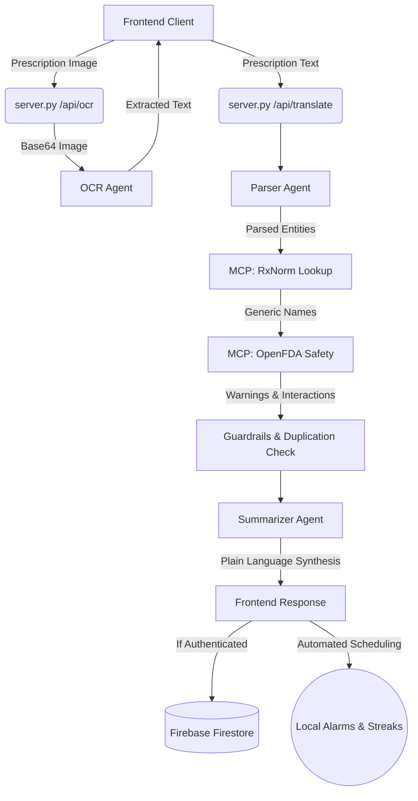

# RxPlain: Prescription Plain-Language Translator

RxPlain is a full-stack web application designed to translate medical shorthand on prescriptions into plain-language instructions. It simultaneously checks real-time FDA safety data for contraindications, cross-drug interactions, food warnings, and therapeutic duplications. It also features user authentication, streak tracking, and automated medication reminders.

## 🏗️ Architecture

RxPlain is built using the Agent Development Kit (ADK) pattern, running an event loop and exposing an HTTP API. It leverages the Model Context Protocol (MCP) to standardize external tool connections.



### Core Components
- **Frontend**: A responsive Vanilla HTML/CSS/JS application that collects inputs, handles Firebase user sessions, manages local alarms/streaks, and dynamically renders the parsed medical data.
- **Backend API**: A standard Python `HTTPServer` (`server.py`) serving the frontend and exposing `/api/translate` and `/api/ocr` endpoints.
- **MCP Server** (`mcp_server.py`): Provides critical MCP tools:
  - `lookup_drug`: Queries the NIH RxNorm API to map drug shorthand into standard generic concepts.
  - `get_safety_data`: Queries the openFDA API to extract boxed warnings, adverse reactions, and check for active drug/food interactions.
- **AI Agents** (`agents.py`): A chain of specialized ADK-native agents handles the request:
  1. **Parser Agent**: Decodes medical shorthand (e.g. `Amoxicillin 500mg, tds oral 5 days`) into distinct fields (Dose, Frequency, Route, Duration).
  2. **Lookup Agent**: Standardizes the parsed drug name against RxNorm.
  3. **Safety Agent**: Pulls FDA label safety data and performs string-matching to detect critical interactions.
  4. **Summarizer Agent**: Sends the parsed dosage and safety warnings to Groq's LLM to generate an empathetic, plain-language summary for the patient.

## 🚀 Workflows

### 1. Translation Workflow
When a user submits a prescription:
1. **Pre-processing**: The input is split by newlines or list numbers.
2. **Parsing**: `parser_agent` extracts precise medical fields (`drug_dose`, `frequency_raw`, `duration_days`, etc.).
3. **Lookup**: The extracted `drug_name` is sent to the RxNorm API to find its generic equivalent.
4. **Safety Check**: The generic name is sent to OpenFDA. It checks the label for:
   - Interactions against the user's *other active medications*.
   - Food and beverage warnings.
   - Serious Boxed Warnings and common side effects.
5. **Synthesis**: The `summarizer_agent` generates the final text.
6. **Guardrails**: Strict deterministic checks are applied before sending the response to the client.

### 2. Reminder & Streak Workflow (Logged In)
1. **Sync**: On login, the frontend fetches the user's active prescriptions from Firebase Firestore.
2. **Auto-Scheduling**: When a new prescription is translated, the frontend maps the parsed frequency (e.g., `bid` -> 09:00, 21:00) and duration, saving alarms to Firestore.
3. **Streaks**: A background loop checks `activeReminders` against the current time. The user marks doses as taken, which updates their daily adherence streak.

## 📖 Detailed Setup Guide

### 1. Prerequisites
- Python 3.10+
- A [Groq API Key](https://console.groq.com/keys)
- A Firebase project (for Auth and Firestore)

### 2. Environment Variables
Create a `.env` file in the root directory (or export these variables in your shell):
```ini
GROQ_API_KEY="your_groq_key"
FIREBASE_API_KEY="your_firebase_key"
FIREBASE_AUTH_DOMAIN="your_firebase_auth_domain"
FIREBASE_PROJECT_ID="your_firebase_project_id"
FIREBASE_STORAGE_BUCKET="your_firebase_storage_bucket"
FIREBASE_MESSAGING_SENDER_ID="your_firebase_messaging_sender_id"
FIREBASE_APP_ID="your_firebase_app_id"
```
*Note: The frontend fetches these safely via the `/api/config` endpoint at runtime.*

### 3. Local Development
1. Clone the repository and install dependencies:
   ```bash
   git clone https://github.com/BhavishyaVerma05/RxPlain.git
   cd RxPlain
   python -m venv .venv
   .venv\Scripts\activate  # (or source .venv/bin/activate on Mac/Linux)
   pip install -r requirements.txt
   ```
2. Start the backend server:
   ```bash
   python backend/server.py
   ```
3. Open your browser and navigate to: `http://localhost:8080`

### 4. Cloud Deployment (Google Cloud Run)
The easiest way to deploy RxPlain is via Google Cloud Run linked to your GitHub repository.

1. Go to the [Google Cloud Console](https://console.cloud.google.com/run).
2. Click **Create Service**.
3. Select **Continuously deploy new revisions from a source repository** and connect your GitHub account.
4. Select the `RxPlain` repository and the `^main$` branch.
5. Set the Build Type to **Dockerfile** (path: `/Dockerfile`).
6. Allow **unauthenticated invocations**.
7. In the **Variables & Secrets** tab, add your `GROQ_API_KEY` and `FIREBASE_*` variables.
8. Click **Create**. Cloud Run will automatically build and deploy your app.

## 🧪 Testing
You can test the translation pipeline via Python without starting the full web server:
```bash
python backend/test_warfarin.py
python backend/test_simvastatin.py
```
